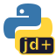

# pydemetra



Python front-end to [JDemetra+](https://github.com/jdemetra), which is a [Java](https://www.java.com/en/) package for **seasonal adjustment**.

Want to just get going? Head to the [Quick Start](quick_start.ipynb) page.

This project has no affiliation the original JDemetra+, but we're grateful to its creators!

## Functionality

pydemetra was inspired by the [rjdverse](https://github.com/rjdverse) R front-end to JDemetra+. Without that package, this one would not be possible. Not all of the functionality of either JDemetra+ or the R front-end is implemented in this package.

### Implemented

- **X-13ARIMA-SEATS** seasonal adjustment (X-13, X-11, RegARIMA)
- **TRAMO-SEATS** seasonal adjustment (TRAMO, SEATS)
- **Calendars and trading days** — national calendars, fixed/Easter/weekday holidays, trading day regressors
- **ARIMA modelling** — SARIMA, UCARIMA, estimation, decomposition, simulation
- **Regression variables** — outliers (AO, LS, TC, SO), ramps, interventions, Easter/leap-year effects, periodic dummies, trigonometric variables
- **Statistical tests** — seasonality, normality, trading days, autocorrelation
- **Time series utilities** — aggregation, interpolation, differencing, length-of-period adjustment
- **Distributions** — t, chi-squared, gamma, inverse gamma, inverse Gaussian
- **Splines** — B-splines, natural/monotonic/periodic cubic splines
- **Benchmarking specification**

### Not implemented


- **STL** decomposition
- **State space** models
- **High-frequency** seasonal adjustment
- **Extended X-11**
- **Benchmarking and temporal disaggregation**
- **Revision analysis**
- **Trend-cycle filters**

## Prerequisites

- Python 3.11+
- Java 17+ (the JVM is started automatically on first use)

Most functions that interact with JDemetra+ Java classes require a running JVM. The JVM is started lazily on the first call — no manual setup needed as long as Java 17+ is on your `PATH` or `JAVA_HOME` is set.

### Installing Java on MacOS

To install a recent version of Java, run

```
brew install openjdk
export PATH="/opt/homebrew/opt/openjdk/bin:$PATH"
```

and then restart your terminal.

## Development

1. git clone repo
2. branch
3. install with development requirements using `uv sync`
4. do the work you need to
5. `uv run nox` for full test suite; everything should pass
